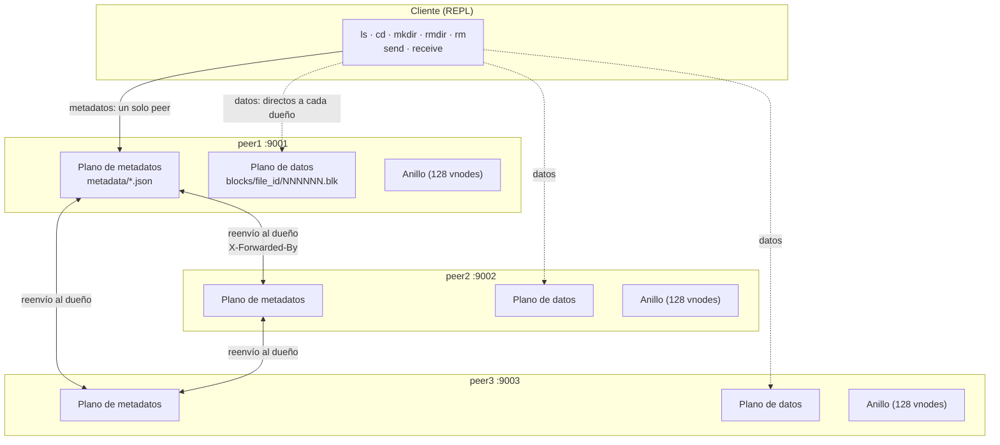
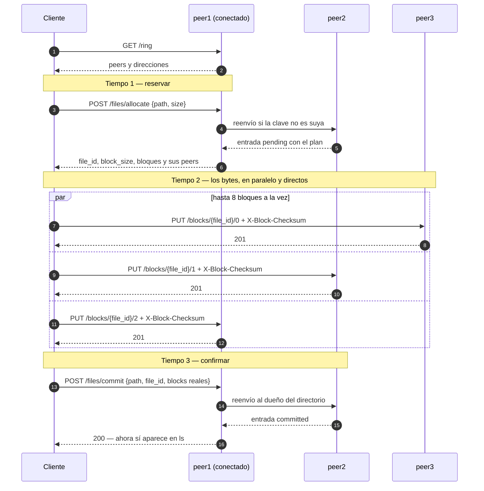
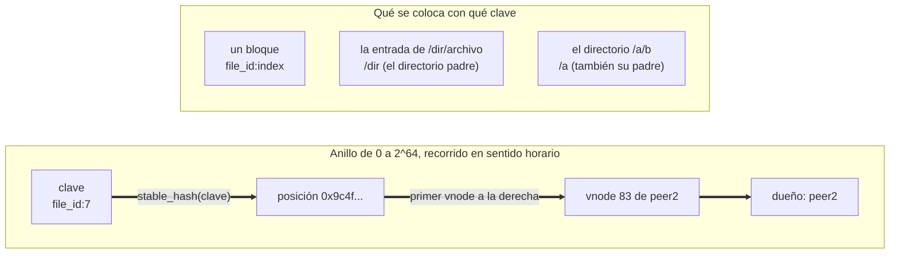

# DFSha — sistema de archivos distribuido por bloques

Proyecto de **Sistemas Distribuidos (SI3007, EAFIT)** — opción 2 del enunciado:
un sistema de archivos distribuido con arquitectura **P2P de SuperPeers**.

**Integrantes:** Emily Cardona · Mateo Villada · Alejandro Rendón

---

## 1. Qué es

DFSha es un sistema de archivos distribuido que reparte **bloques** de archivos
entre varios nodos iguales. Un archivo que se sube no se guarda entero en
ningún sitio: se trocea en bloques de tamaño fijo y cada bloque viaja al nodo
al que le toca, calculado con un anillo de hashing consistente. Para leerlo, el
cliente pregunta dónde quedó cada bloque, los baja **en paralelo** de los nodos
que los tienen, verifica el SHA-256 de cada uno y los reensambla por índice.

Todos los nodos son **simétricos**: exponen la misma API HTTP, guardan
metadatos y bloques, y cualquiera de ellos sabe responder cualquier pregunta
sobre el sistema. Si la clave que se le pide no le pertenece, reenvía al dueño
y devuelve su respuesta tal cual. Es la forma en que este proyecto realiza el
rol de SuperPeer del enunciado: en vez de un nodo especial que indexa y varios
que solo almacenan, **cada peer es a la vez índice y almacén**, y el índice
está repartido por el mismo anillo que reparte los datos. No hay coordinador,
no hay maestro, no hay un nodo cuya caída pare el sistema — y no hay ningún
punto donde preguntar «¿quién manda aquí?», porque la respuesta se calcula.

El cliente es un REPL con nueve operaciones (`ls`, `cd`, `pwd`, `mkdir`,
`rmdir`, `rm`, `send`, `receive`, `exit`) que se conecta al primer peer vivo
que encuentre. Para los metadatos habla con **uno**; para los datos habla con
**todos los que hagan falta**, sin que ningún byte atraviese un peer que no sea
su destino.

---

## 2. Qué se lleva hecho

El **hito 2 está completo**. Seis especificaciones, todas cerradas, cada una
con sus tests:

| SPEC | Qué dejó hecho |
|---|---|
| [SPEC-01](docs/SPEC-01.md) | El `send` del monolito: subir un archivo a un servidor, con sus códigos de error y sin dejar archivos a medias |
| [SPEC-02](docs/SPEC-02.md) | El anillo de hashing consistente con nodos virtuales, la membresía, y la configuración por entorno: `GET /health`, `GET /ring`, `POST /peers/join` |
| [SPEC-03](docs/SPEC-03.md) | El almacén de bloques inmutables y verificables, direccionable por `(file_id, index)`, con su jaula de disco |
| [SPEC-04](docs/SPEC-04.md) | El espacio de nombres repartido por el anillo: `allocate`, `commit`, `lookup`, las cuatro operaciones de directorio y el reenvío al dueño |
| [SPEC-05](docs/SPEC-05.md) | El cliente distribuido: `send` y `receive` en tres tiempos, en paralelo y directos a los peers de datos |
| [SPEC-06](docs/SPEC-06.md) | El despliegue con Docker y el guion de demostración que recorre los cuatro actos sin intervención |

Lo que **no** está y es del hito 3:

- **Replicación.** El factor de réplica vale 1 y está en un solo sitio
  (`metadata.REPLICAS`). El anillo ya devuelve N peers distintos para una clave
  y el `commit` ya exige N confirmaciones distintas: subirlo a 3 no pide tocar
  la lógica, pide decidir qué pasa cuando una réplica falla.
- **Reconciliación de anillos divergentes.** Hoy, un peer que no contesta a un
  alta se queda con una membresía vieja y nadie lo repara.
- **Tolerancia a fallos durante una operación.** Un `send` con un peer caído
  falla entero y deja el nombre reservado; soltarlo es un `rm` manual.
- **Redistribución de bloques al entrar o salir un peer.** Las claves se
  remapean, pero los `.blk` que ya están escritos no se mueven solos.
- **Autenticación, TLS y cuotas.** No hay ninguna.

---

## 3. Arquitectura

Cada peer es un proceso FastAPI con **dos planos separados**, y los dos se
reparten por el mismo anillo:

- **Plano de metadatos** — el contenido de los directorios que le tocan. Sabe
  qué archivos existen, de qué tamaño son y en qué peer quedó cada bloque.
- **Plano de datos** — bloques crudos, direccionados por `(file_id, index)`.
  Deliberadamente tonto: no sabe a qué archivo pertenece un bloque, ni en qué
  orden va, ni si él era el destino correcto.

Cuatro decisiones sostienen el diseño.

### 3.1 Hashing consistente sobre un anillo, no round robin ni módulo N

La pregunta que todo el sistema tiene que responder sin coordinarse es **de
quién es esta clave**. Con `hash(clave) % N` la respuesta es correcta y barata
mientras N no cambie; el día que entra o sale un peer, cambia para casi todas
las claves a la vez, y en un sistema que guarda bytes eso no es un recálculo:
es mover el disco entero.

Medido con el código de este repositorio (2000 claves con la forma real
`file_id:index`, pasando de tres peers a cuatro — se reproduce con
`tests/test_ring.py`):

| Colocación | Claves remapeadas al entrar el cuarto peer |
|---|---|
| Anillo de hashing consistente, 128 vnodes | **21,75 %** |
| `stable_hash(clave) % N` | **73,50 %** |

Y hay una diferencia más fuerte que el porcentaje: de las 435 claves que el
anillo movió, **las 435 fueron al peer que entró**. Ninguna cambió de dueño
entre dos peers que ya estaban. Con módulo N, casi todas las movidas van a
parar a un peer que no tiene nada que ver con el que entró, así que los bloques
habría que copiarlos entre nodos que no cambiaron. Esa propiedad —el que entra
roba, nadie más se toca— es la que hace posible la replicación del hito 3.

Los **nodos virtuales** (128 por peer, `DFSHA_VNODES`) existen porque tres
puntos en un anillo reparten mal: con uno por peer, el reparto depende de dónde
caigan tres hashes. Con 128, el reparto real sobre 2000 claves es 33,6 % /
33,2 % / 33,2 %.

El hash es **SHA-1 truncado a 64 bits sobre UTF-8**, nunca el `hash()` de
Python: ese está aleatorizado por proceso vía `PYTHONHASHSEED`, y tres peers
calcularían tres anillos distintos con un fallo intermitente e invisible.

### 3.2 Archivo = directorio, bloque = archivo

En disco, un archivo del DFS no es un archivo: es un **directorio** llamado
como su `file_id`, y dentro hay un archivo por bloque
(`000000.blk`, `000001.blk`, ...). El índice va con seis dígitos y relleno de
ceros para que el orden alfabético sea el orden numérico.

No es una convención de nombres, es lo que permite que el almacén sea tonto:
escribir el bloque 7 no necesita saber cuántos bloques tiene el archivo, ni que
exista el 6, ni coordinarse con nadie. Borrar un archivo de un peer es borrar
un directorio, **la tenga o no** — por eso `DELETE /blocks/{file_id}` responde
`200` con `"deleted": 0` en vez de `404`: el borrado se lanza a varios peers a
la vez y la mayoría no tendrán nada, y «no tengo nada» es una respuesta, no un
fallo.

La ruta del bloque está **enteramente sintetizada por el sistema**: un UUID no
puede contener `/` ni `..`, así que ninguna cadena del usuario llega a formar
parte de ella.

### 3.3 WORM: se escribe una vez, se lee muchas, no se toca

Un bloque escrito no se sobrescribe nunca. `PUT` de un bloque que ya existe
responde `409`, no lo reemplaza.

Es lo que hace que un bloque sea **verificable**: el `PUT` trae su SHA-256 en
`X-Block-Checksum`, el peer lo recalcula sobre lo que escribió y si no cuadra
responde `422` **y borra lo escrito** antes de contestar. No quedan bloques
corruptos. Y como nadie los modifica después, ese checksum sigue siendo válido
para siempre: el `receive` lo comprueba bloque a bloque contra el que quedó
confirmado en los metadatos, no contra la cabecera que devuelve el peer —si el
bloque se corrompió en su disco, la cabecera se corrompió con él.

Sin WORM, un reintento de subida podría dejar un bloque medio escrito sobre uno
bueno, y la replicación del hito 3 tendría que resolver qué copia es la buena.
Con WORM esa pregunta no existe.

### 3.4 Tres tiempos, y los bytes van directos a los peers de datos

Subir un archivo son tres llamadas de metadatos y N de datos:

1. **`allocate`** — el cliente reserva la ruta y recibe el plan: `file_id`,
   `block_size` y, para cada bloque, a qué peer le toca. El archivo todavía no
   existe para nadie.
2. **Los bloques** — el cliente los sube **en paralelo y directos** a sus
   peers, hasta ocho a la vez.
3. **`commit`** — el cliente confirma con los checksums y **dónde quedó cada
   bloque de verdad**, no dónde lo planeó el `allocate`. Hasta aquí el archivo
   no aparece en `ls` ni lo encuentra `lookup`.

Lo importante es lo que **no** se hizo: no hay ningún endpoint que reciba un
archivo entero. La alternativa obvia —que un peer reciba el archivo, lo trocee
y reparta los bloques— haría que **cada byte cruzara un peer que no es su
destino**, duplicando el tráfico y convirtiendo al peer conectado en el cuello
de botella de todo el sistema. Con el cliente orquestando, ese peer ve tres
peticiones pequeñas y ni un solo byte de datos.

El precio es que **el cliente conoce la topología**: pide `GET /ring` y usa las
direcciones que le devuelve. Eso tiene una consecuencia práctica muy concreta
en Docker, y está explicada en [§6.3](#63-la-frontera-de-la-red-por-qué-send-y-receive-solo-funcionan-desde-dentro).

Que el `commit` reporte dónde quedaron los bloques de verdad obliga a
validarlo: cada `peer_id` tiene que existir en el anillo y los peers de un
bloque se cuentan distintos. Sin eso, el cliente podría escribir cualquier cosa
y los metadatos mentirían, solo que con más pasos.

---

## 4. Diagramas

### 4.1 Topología: tres peers simétricos, dos planos en cada uno



Los tres anillos son idénticos y ninguno se negoció: cada peer lo deriva de su
`DFSHA_BOOTSTRAP` al arrancar, sin emitir una sola petición.

### 4.2 Protocolo de escritura: `send` en tres tiempos



Si un solo `PUT` falla, no hay `commit`: el archivo no existe para nadie. Lo
único que queda es la entrada pendiente ocupando el nombre, y un `rm` la
suelta y se lleva los bloques que sí llegaron.

### 4.3 El anillo: dónde cae una clave



La clave de un bloque es `file_id:index`, así que dos bloques del mismo archivo
caen en peers distintos: eso es el reparto. La clave de una entrada de
metadatos es **el directorio padre**, así que el dueño de un directorio guarda
todo su contenido y un `ls` es **una sola llamada a un solo peer**, no un
barrido de los N.

---

## 5. Estructura del proyecto

```
server/                  El peer. Todos exponen la misma API.
  main.py                Los 16 endpoints HTTP. Validan, delegan y responden.
  config.py              La configuración, leída del entorno al importar.
  ring.py                El anillo de hashing consistente. No toca red ni disco.
  membership.py          El alta de peers y su propagación de una ronda.
  routing.py             El reenvío al dueño. Ni una regla de negocio.
  metadata.py            El espacio de nombres: allocate, commit, lookup, directorios.
  blocks.py              El almacén de bloques: escribir, leer, borrar, verificar.
  filesystem.py          La jaula del disco: la única comprobación de contención.

client/                  El cliente. Un REPL y la lógica que lo sostiene.
  client.py              El bucle del REPL y sus nueve comandos.
  commands.py            Cada comando: a quién se le pide y qué se hace con la respuesta.
  transfer.py            El troceado y el reensamblado. Sin una sola petición.

demo/                    La demostración del hito 2.
  guion.py               Orquesta desde el anfitrión: levanta, para, arranca, resume.
  actos.py               Ejecuta cada acto desde dentro de la red de Docker.

tests/                   285 tests. Ninguno abre un socket de verdad.
docs/                    CONTRATOS.md y las seis SPECs.
Dockerfile               Una sola imagen para los tres peers y el cliente.
docker-compose.yml       Tres peers en 9001-9003, más el servicio del cliente.
.env.example             Las seis variables, con lo que significa cada una.
```

### El layout en disco

Cada peer guarda **dos árboles separados** bajo su `DFSHA_STORAGE_ROOT`:

```
<STORAGE_ROOT>/
  blocks/
    5f3e0000-.../         un directorio por archivo, llamado como su file_id
      000000.blk          un archivo por bloque
      000003.blk          solo los que le tocaron a ESTE peer
  metadata/
    a3f19c04....json      el contenido de los directorios cuya clave le toca
```

**Por qué separados y no un solo árbol.** `resolve_path` recibe la raíz como
parámetro y no tiene valor por defecto, porque anclar una única jaula en
`STORAGE_ROOT` no bastaría: una ruta con `..` desde un árbol caería **dentro**
de `STORAGE_ROOT`, pasaría la comprobación y aterrizaría en el árbol de al
lado. `metadata/../blocks/<file_id>` es exactamente ese caso. La jaula tiene
que moverse con el plano que protege, y como hay dos planos hacen falta dos
raíces. Es la única comprobación de contención del sistema: no hay una segunda
en ningún otro sitio.

Los bloques y los metadatos viven en el volumen, no en memoria, así que
sobreviven a un reinicio del peer.

---

## 6. Cómo probarlo

Dos caminos. El de Docker es el que demuestra el sistema entero; el local sirve
para trabajar en el código sin construir imágenes.

### 6.1 Con Docker (recomendado)

**Antes de nada: arranca Docker Desktop y espera a que diga que está
corriendo.** Es el error más probable: sin el demonio en marcha, todo lo que
sigue falla en el primer comando. El guion lo detecta y lo dice.

```bash
git clone <este-repo>
cd Sistemas-Distribuidos-P2P

docker compose up -d --wait
```

`--wait` no devuelve el control hasta que los tres peers contestan su
healthcheck. Comprobación rápida:

```bash
curl http://127.0.0.1:9001/health
curl http://127.0.0.1:9002/health
curl http://127.0.0.1:9003/health
```

```json
{"peer_id":"peer1","status":"ok","ring_version":"034da115"}
{"peer_id":"peer2","status":"ok","ring_version":"034da115"}
{"peer_id":"peer3","status":"ok","ring_version":"034da115"}
```

En PowerShell, `curl` es un alias de otra cosa; usa
`Invoke-RestMethod http://127.0.0.1:9001/health`.

**El mismo `ring_version` en los tres es la primera cosa que hay que mirar.**
Significa que los tres calcularon el mismo anillo, y ninguno tuvo que
preguntárselo a nadie para conseguirlo.

#### La demostración completa

```bash
python demo/guion.py
```

Tarda un minuto o dos, no pide nada por teclado y termina con un resumen.
Levanta el despliegue **desde cero** (`down -v` primero, porque una demo que
depende de lo que quedó de la vez anterior no es repetible) y recorre cuatro
actos. Lo que tiene que verse en cada uno:

**Acto 1 — el anillo converge sin que nadie lo negocie.** Los tres
`ring_version` iguales:

```
  peer1  ring_version=034da115  ve a peer1, peer2, peer3
  peer2  ring_version=034da115  ve a peer1, peer2, peer3
  peer3  ring_version=034da115  ve a peer1, peer2, peer3
```

**Acto 2 — un archivo repartido.** Sube 1,5 MiB que, con el tamaño de bloque
del despliegue (64 KiB), son 24 bloques. Después le pregunta **a los tres
peers por cada bloque** con `GET /blocks/{file_id}/{index}` y dibuja quién
contestó `200`:

```
bloque  peer1 peer2 peer3
     0      ·     ·     X
     1      ·     X     ·
     2      X     ·     ·
    ...
reparto: peer1=11  peer2=6  peer3=7
No es un tercio exacto y no tiene que serlo: la colocacion es un hash, no un
turno, y con dos docenas de claves la varianza se ve.
```

El reparto **cambia en cada ejecución** y no es un tercio exacto: el `file_id`
se sortea en cada `allocate`, así que las 24 claves son otras. Lo que el acto
comprueba es que cada bloque tiene **exactamente un** tenedor, que coincide con
lo que dice `lookup`, y que los tres peers guardan alguno.

**Acto 3 — la lectura, byte a byte.** Baja el archivo y compara el SHA-256 con
el del original:

```
  original  7cda80de8de891dad4bf9b836ec0741b14d5a87b217d92e09f37c4dd36711775  (1572864 bytes)
  bajado    7cda80de8de891dad4bf9b836ec0741b14d5a87b217d92e09f37c4dd36711775  (1572864 bytes)
Identico byte a byte.
```

**Acto 4 — el ciclo del fallo.** Calcula quién es el dueño del directorio de la
demo, **para los otros dos peers** y sube con el sistema roto a propósito:

```
  dueno de la demo: peer2 — se paran peer1, peer3
send fallo.bin con dos peers parados:
  | Error: no se pudo conectar con el servidor
  ls /demo -> reparto.bin
  lookup /demo/fallo.bin -> 404
repetir el mismo send:
  | Error 409: El archivo ya existe

  peer2 sirve 7 de los 24 bloques: [3, 4, 6, 8, 11, 14, 18]
rm /demo/fallo.bin:
  | Archivo eliminado correctamente
  peer2 sirve ahora 0 bloques de ese archivo
```

El archivo **no existe** —no sale en `ls`, `lookup` da `404`— pero el nombre sí
está ocupado por la entrada pendiente, y por eso repetir el `send` da `409`. El
`rm` suelta el nombre y se lleva los bloques que sí habían subido. Luego el
guion levanta los dos peers y repite el mismo `send`, que ahora funciona.

Se paran **dos** peers y no uno porque uno no basta para que la demo sea
repetible: la probabilidad de que el peer parado no tuviera ningún bloque es
`(2/3)²⁴`, una entre diecisiete mil. Con dos, `(1/3)²⁴`.

Y termina:

```
  Acto 1  convergencia .................... BIEN
  Acto 2  reparto ......................... BIEN
  Acto 3  lectura ......................... BIEN
  Acto 4  ciclo del fallo ................. BIEN

TODO BIEN: True
```

Si algo falla, el acto lo dice con nombre y apellidos (qué bloque, qué peer) y
el resumen sale en `TODO BIEN: False` con código de salida distinto de cero.

#### Usarlo a mano

```bash
docker compose run --rm cliente
```

Abre el REPL **dentro de la red de Docker**, que es donde funciona todo:

```
DFSha:/ > mkdir universidad
DFSha:/ > cd universidad
DFSha:/universidad > send /app/demo/actos.py
DFSha:/universidad > ls
DFSha:/universidad > receive actos.py
DFSha:/universidad > exit
```

#### Parar

```bash
docker compose down      # para los peers y conserva los datos
docker compose down -v   # para los peers y borra los volúmenes
```

### 6.2 En local, sin Docker

```bash
python -m venv .venv
.venv\Scriptsctivate          # Windows
source .venv/bin/activate       # Linux y macOS

pip install -r requirements.txt
```

La configuración entera son **seis variables de entorno**, todas con valor por
defecto ([.env.example](.env.example) las documenta):

| Variable | Por defecto | Qué es |
|---|---|---|
| `DFSHA_PEER_ID` | `peer1` | La identidad del peer en el anillo. Tiene que ser estable entre reinicios: si cambia, todas sus claves se remapean y sus bloques quedan inalcanzables |
| `DFSHA_ADDRESS` | `http://127.0.0.1:8000` | La dirección que este peer anuncia. Es la que otros peers y el cliente usarán para hablarle |
| `DFSHA_BOOTSTRAP` | vacío | La membresía, como `peer1=url,peer2=url,...`. **Idéntica en los tres.** Un peer que figura en su propio bootstrap no emite ninguna petición al arrancar |
| `DFSHA_STORAGE_ROOT` | `server/storage` | Su raíz de datos. Tres peers en la misma máquina necesitan tres distintas o se pisan los bloques |
| `DFSHA_BLOCK_SIZE` | `4194304` (4 MiB) | El tamaño de bloque |
| `DFSHA_VNODES` | `128` | Posiciones virtuales por peer. No bajarlo: con pocas, tres peers reparten mal |

**Levantar tres peers a mano.** Tres terminales, una por peer. En PowerShell:

```powershell
# Terminal 1
$env:DFSHA_BOOTSTRAP="peer1=http://127.0.0.1:9001,peer2=http://127.0.0.1:9002,peer3=http://127.0.0.1:9003"
$env:DFSHA_PEER_ID="peer1"; $env:DFSHA_ADDRESS="http://127.0.0.1:9001"; $env:DFSHA_STORAGE_ROOT="./data/peer1"
.venv\Scripts\python.exe -m uvicorn server.main:app --port 9001
```

```powershell
# Terminal 2 — igual, cambiando los tres valores propios
$env:DFSHA_PEER_ID="peer2"; $env:DFSHA_ADDRESS="http://127.0.0.1:9002"; $env:DFSHA_STORAGE_ROOT="./data/peer2"
.venv\Scripts\python.exe -m uvicorn server.main:app --port 9002
```

En bash es la misma idea en una línea:

```bash
export DFSHA_BOOTSTRAP="peer1=http://127.0.0.1:9001,peer2=http://127.0.0.1:9002,peer3=http://127.0.0.1:9003"

DFSHA_PEER_ID=peer1 DFSHA_ADDRESS=http://127.0.0.1:9001 DFSHA_STORAGE_ROOT=./data/peer1 \
  python -m uvicorn server.main:app --port 9001
```

El orden de arranque **da igual**: cada peer coloca a los otros dos en el
anillo leyendo el bootstrap, sin hablar con ellos. Comprobado arrancándolos al
revés y con veinte segundos entre medias — los tres dan el mismo
`ring_version` y en los logs no hay ni un `POST /peers/join`.

**El cliente**, en una cuarta terminal, desde la raíz del repositorio:

```bash
export DFSHA_BOOTSTRAP="peer1=http://127.0.0.1:9001,peer2=http://127.0.0.1:9002,peer3=http://127.0.0.1:9003"
python -m client.client
```

Sesión real contra tres peers locales:

```
========================================
          DFSha Client
========================================
Conectado a http://127.0.0.1:9001

DFSha:/ > mkdir universidad
Directorio creado correctamente
DFSha:/ > cd universidad
DFSha:/universidad > send /ruta/a/local.bin
Archivo subido correctamente
DFSha:/universidad > ls
[FILE] local.bin
DFSha:/universidad > receive local.bin
Archivo descargado correctamente
```

Aquí `send` y `receive` **sí funcionan**, porque las direcciones del anillo son
`127.0.0.1:900N` y el cliente corre en la misma máquina. Con el tamaño de
bloque por defecto (4 MiB) un archivo pequeño es un solo bloque y no se ve el
reparto; para verlo, baja `DFSHA_BLOCK_SIZE` en los tres peers (el despliegue
de Docker usa 65536) o sube un archivo grande.

### 6.3 La frontera de la red: por qué `send` y `receive` solo funcionan desde dentro

Con el despliegue de Docker, el anillo guarda **nombres de contenedor**:
`http://peer2:9002`. Es la única opción que sirve a la vez a los peers (que se
reenvían entre ellos) y al cliente de dentro (que manda cada bloque directo a
su dueño). Desde el anfitrión, esos nombres no se resuelven.

La consecuencia es exacta y conviene conocerla antes de chocarse con ella:

| Desde el anfitrión (`127.0.0.1:900N`) | ¿Funciona? |
|---|---|
| `curl /health`, `/ring`, `/files`, `/files/lookup` | Sí |
| `ls`, `cd`, `pwd`, `mkdir`, `rmdir`, `rm` del CLI | Sí |
| `send` y `receive` | **No** |

Los metadatos funcionan porque el peer que recibe la petición **reenvía por
dentro** de la red si la clave no es suya. Los datos no, porque son lo único
que usa las direcciones del anillo directamente.

Esta es la sesión real, con el CLI ejecutado en el anfitrión contra los
contenedores:

```
DFSha:/demo > ls
[FILE] fallo.bin
[FILE] reparto.bin
DFSha:/demo > send C:\...\anfitrion.bin
Error: no se pudo conectar con el servidor
DFSha:/demo > ls
[FILE] fallo.bin
[FILE] reparto.bin
DFSha:/demo > rm anfitrion.bin
Archivo eliminado correctamente
```

Léase de arriba abajo: el `ls` funciona. El `send` **no llega a subir ni un
bloque** — lo que se cae es el `PUT` a `http://peer2:9002`, un nombre que el
anfitrión no resuelve; el mensaje del CLI dice «no se pudo conectar con el
servidor» sin decir cuál, y ese cuál es un peer por su nombre de contenedor. El
segundo `ls` confirma que no quedó nada a medias. Y que el `rm` responda
«Archivo eliminado correctamente» demuestra que el `allocate` **sí había
funcionado** y había reservado el nombre: lo que falló fue el plano de datos,
no el de metadatos.

**La solución es entrar en la red**, no cambiar nada:

```bash
docker compose run --rm cliente
```

Las alternativas se estudiaron y ninguna sirve: `host.docker.internal` lo
resuelven los contenedores y no el anfitrión; `network_mode: host` es solo
Linux; y añadir `peer1 peer2 peer3` al archivo `hosts` del anfitrión pide
permisos de administrador y hay que deshacerlo a mano.

---

## 7. API

Todos los peers exponen **la misma API**: son simétricos. Si la clave que se
pide no le pertenece al peer, reenvía al dueño con `X-Forwarded-By` y devuelve
su respuesta tal cual; un peer que recibe una petición ya marcada y tampoco es
el dueño responde `508` en vez de reenviar otra vez.

El contrato completo —cuerpos, códigos de error y sus textos literales— está en
**[docs/CONTRATOS.md](docs/CONTRATOS.md)**.

### Anillo y membresía

| Endpoint | Qué hace |
|---|---|
| `GET /health` | `peer_id`, `status` y `ring_version` de este peer |
| `GET /ring` | La membresía completa: `peer_id` y dirección de cada peer |
| `POST /peers/join` | Da de alta un peer y propaga el alta una ronda |

### Plano de metadatos

| Endpoint | Qué hace |
|---|---|
| `POST /files/allocate` | Reserva la ruta y devuelve el plan con `state: pending` |
| `POST /files/commit` | Confirma con los checksums y los peers reales |
| `GET /files/lookup?path=` | La entrada completa. Solo las confirmadas |
| `GET /files?path=` | `ls`: el contenido de un directorio |
| `POST /directories` | `mkdir` |
| `DELETE /directories?path=` | `rmdir` |
| `DELETE /files?path=` | `rm`: borra la entrada y lanza el borrado de sus bloques |
| `POST /directories/content` | Crea el contenido vacío de un directorio. Idempotente |
| `DELETE /directories/content?path=` | Borra el contenido si está vacío |

Las dos últimas las llama **otro peer**, no el cliente: la existencia de un
directorio se registra dos veces —una entrada hija en su padre, y su propio
contenido en su dueño— y por eso `mkdir` y `rmdir` son las únicas operaciones
que tocan dos peers. El precio lo pagan ellas, que son raras, y lo cobra
`allocate`, que es el camino caliente y resuelve sus dos comprobaciones sin
salir del peer.

### Plano de datos

| Endpoint | Qué hace |
|---|---|
| `PUT /blocks/{file_id}/{index}` | Escribe un bloque. `409` si ya existe (WORM), `422` si el checksum no cuadra |
| `GET /blocks/{file_id}/{index}` | Devuelve el bloque y su checksum |
| `DELETE /blocks/{file_id}` | Borra todos los bloques de ese archivo en este peer. Idempotente |

---

## 8. Tests

```bash
# En el anfitrión
python -m pytest tests/ -q

# Dentro del contenedor (Linux)
docker compose run --rm cliente python -m pytest tests/ -q
```

**285 tests.** Ninguno abre un socket de verdad ni necesita los peers
levantados: lo que habla por red se prueba contra dobles, y lo que no habla
—el anillo, el troceado, la jaula— se prueba directamente.

| Archivo | Tests | Qué cubre |
|---|---|---|
| `test_metadata.py` | 60 | El espacio de nombres: normalización de rutas, `allocate`, `commit`, `lookup` y las cuatro operaciones de directorio |
| `test_blocks.py` | 45 | El almacén: WORM, checksums, escritura atómica, borrado idempotente, validación de `file_id` e `index` |
| `test_client_transfer.py` | 24 | `send` y `receive` contra peers dobles: el orden de los tres tiempos, el paralelismo y el ciclo del fallo |
| `test_ring.py` | 23 | El anillo: determinismo entre procesos, reparto, estabilidad ante la entrada de un peer, y el umbral que descarta módulo N |
| `test_membership.py` | 22 | El alta, su propagación de una ronda, y que un peer en su propio bootstrap no emite nada |
| `test_routing.py` | 21 | El reenvío al dueño, la cabecera `X-Forwarded-By` y el `508` del bucle |
| `test_transfer.py` | 20 | El troceado y el reensamblado por índice, sin una sola petición |
| `test_jaulas.py` | 17 | La jaula del disco: que ninguna ruta del usuario alcanza los bloques, y que la jaula no rechaza su propio árbol |
| `test_config.py` | 16 | La configuración por entorno y sus valores por defecto |
| `test_despliegue.py` | 16 | Los invariantes del `docker-compose.yml`, leídos del YAML: mismo bootstrap, y ninguna identidad, puerto ni volumen repetidos |
| `test_demo.py` | 14 | Los ayudantes del guion: el reparto, la matriz y el dueño de un directorio |
| `test_client_bootstrap.py` | 7 | Que el cliente conoce una lista de peers y no un servidor |

### Por qué el número no es el mismo en los dos sitios

```
Anfitrión (Windows):  281 passed, 4 skipped
Contenedor (Linux):   285 passed
```

Son los mismos 285 tests. Los **4 que se saltan en Windows** son los de la
jaula alcanzada por un **enlace simbólico**: crear uno en Windows pide un
privilegio que una sesión normal no tiene, así que el test lo dice y se salta
en vez de fingir que pasó.

Esos cuatro importan justamente en Linux, que es donde corren los contenedores:
si la raíz de datos se alcanza a través de un enlace —y un volumen de Docker
puede montarse así—, `Path.resolve()` lo sigue, y comparar la ruta resuelta con
una raíz sin resolver haría que la jaula rechazara **siempre** su propio árbol.
Por eso la suite se corre en los dos sitios y por eso `tests/` va dentro de la
imagen.
